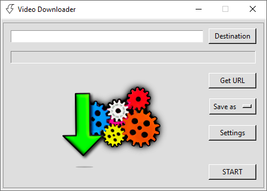
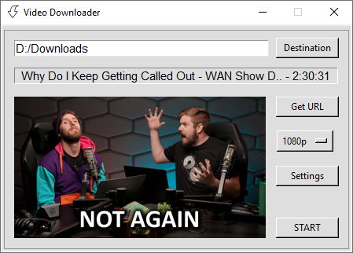

# Video Downloader - In Progress
- Takes the video link from clipboard
    - Displaying the thumbnail, video title and duration
- Video resolution / just audio selectable
- Able to add via browse window or field:
    - Destination folder
    - [YT-DLP](https://github.com/yt-dlp/yt-dlp) path
    - [FFmpeg](https://ffmpeg.org/) path

## In the making

     

 

     

## Where can be used
- `YouTube`
- `Vimeo`
- `Twitch`
- I used to have an imaginary friend, who heard from someone, that on this internet thing there are websites, where uncovered human body parts are displayed in motion. For real.
Well, I cannot confirm personally, but I would say there is a chance the `Video Downloader` works just fine on these sites too.

## Thank you all contributors of the listed `Python modules`, [YT-DLP](https://github.com/yt-dlp/yt-dlp) and [FFmpeg](https://ffmpeg.org/).

