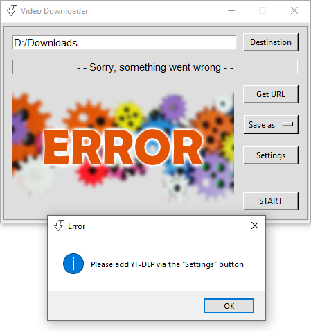

# Video Downloader
- Takes the video link from clipboard
    - Displaying the thumbnail, video title and duration
- Video resolution / just audio selectable
- Able to add via browse window or field:
    - Destination folder
    - [YT-DLP](https://github.com/yt-dlp/yt-dlp) path
    - [FFmpeg](https://ffmpeg.org/) path

<div align="center">
     
</div>
<br>
<div align="center">
     
</div>
<br>
<div align="center">
     
</div>
<br>
<div align="center">
     
</div>

# Requirements
## Python and Modules
### Install packages\dependencies
```
pip install -r requirements.txt
```
### Separately
### Python 3 - used: 3.11
- https://www.python.org/

### Pyperclip
- https://pypi.org/project/pyperclip/

### Pillow
- https://pypi.org/project/Pillow/

## Others
### [YT-DLP](https://github.com/yt-dlp/yt-dlp#release-files)
- You are able to add the path of the `YT-DLP.exe` in the `Settings` window

### [FFmpeg](https://ffmpeg.org/)
- If `FFmpeg` is not added to the system path:
    - You are able to add the path of the `ffmpeg.exe` in the `Settings` window
- [Install FFmpeg on Windows 10/11](https://windowsloop.com/install-ffmpeg-windows-10/)

### OS
- `Windows` (tested on 10)

# Guide
- `Save as` \ `MP3` - saves the best audio source and converts it to MP3
- `Save as` \ video resolutions:
    - Download the best video available with the largest resolution but no better than the selected_resolution (no conversion)
    - Or the best video with the smallest resolution if there is no video under the selected_resolution (no conversion)

# Video Downloader - Where can be used
- `YouTube`
- `Vimeo`
- `Twitch`
- I used to have an imaginary friend, who heard from someone, that on this internet thing there are websites, where uncovered human body parts are displayed in motion. For real.
Well, I cannot confirm personally, but I would say there is a chance the `Video Downloader` works just fine on these sites too.

# Modules used, which are part of Python 3.11
- json
- os
- pathlib
- tkinter
- webbrowser

## Thank you all contributors of the listed `Python modules`, `YT-DLP` and `FFmpeg`!